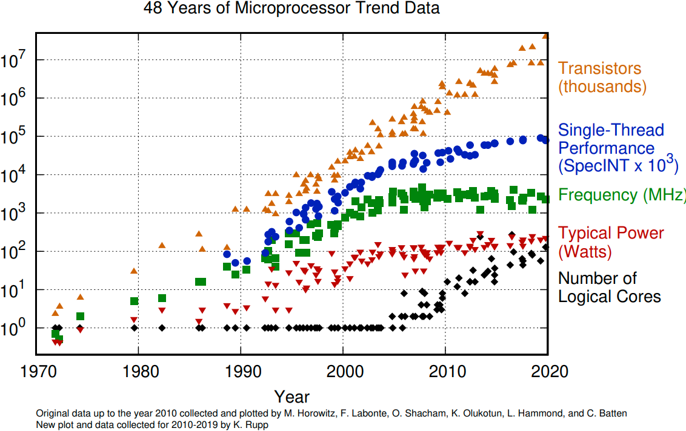
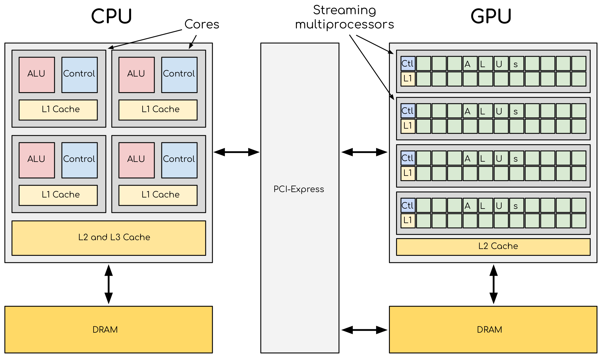
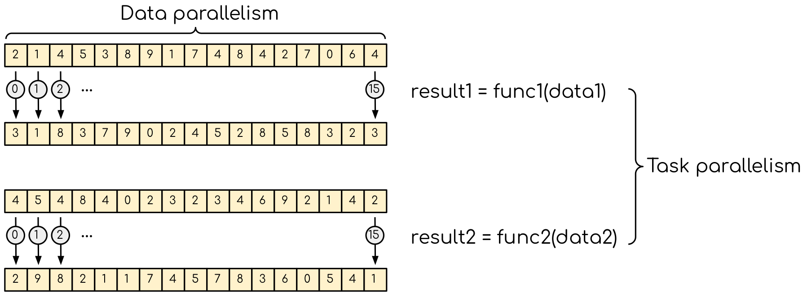

.. _gpu-introduction:

Introduction to GPU
===================

Moore's law
-----------

The number of transistors in a dense integrated circuit doubles every two years.
More transistors mean a smaller size of a single element so that a higher core frequency can be achieved.
However, power consumption scales as the frequency in the third power, so the growth in the core frequency has slowed down significantly.
The higher performance of a single node has to rely on its more complicated structure, but it can still be achieved with SIMD, branch prediction, etc.

   The evolution of microprocessors.
   The number of transistors per chip increases every two years or so.
   However, it can no longer be explored by the core frequency due to power consumption limits.
   Before 2000, the increase in the single-core clock frequency was the major source of the performance increase.
   Mid-2000 marked a transition towards multi-core processors.

Achieving performance has been based on two main strategies over the years:

    - Increase the single processor performance.

    - More recently, increase in the number of physical cores.

Graphics processing units
-------------------------

Graphics processing units (GPU) have been the most common accelerators during the last few years, the term GPU sometimes is used interchangeably with the term accelerator.
GPUs were initially developed for highly parallel tasks of graphic processing.
Over the years, were used more and more in HPC.
GPUs are specialized parallel hardware for floating point operations.
GPUs are co-processors for traditional CPUs: the CPU still controls the workflow, delegating highly parallel tasks to the GPU.
Based on highly parallel architectures, which allows us to take advantage of the increasing number of transistors.

Using GPUs allows one to achieve very high performance per node.
As a result, the single GPU-equipped workstation can outperform small CPU-based clusters for some types of computational tasks.
The drawback is that usually major rewrites of programs are required.

    A comparison of the CPU and GPU architecture.
    CPU (left) has a complex core structure and packs several cores on a single chip.
    GPU cores are very simple in comparison, they also share data and control between each other.
    This allows to packing of more cores on a single chip, thus achieving very high compute density.

One of the most important features that allows the accelerators to reach this high performance is their scalability.
Computational cores on accelerators are usually grouped into multiprocessors.
The multiprocessors share the data and logical elements.
This allows us to achieve a very high density of compute elements on a GPU.
This also allows for better scaling: more multiprocessors means more raw performance and this is very easy to achieve with more transistors available.

Accelerators are a separate main circuit board with the processor, memory, power management, etc.
It is connected to the motherboard with CPUs via a PCIe bus.
Having its memory means that the data has to be copied to and from it.
CPU acts as a main processor, controlling the execution workflow.
It copies the data from its memory to the GPU memory, executes the program, and copies the results back.
GPUs run tens of thousands of threads simultaneously on thousands of cores and do not do much of the data management.
With many cores trying to access the memory simultaneously and with little cache available, the accelerator can run out of memory very quickly.
This makes the data management and its access pattern essential on the GPU.
Accelerators like to be overloaded with the number of threads, because they can switch between threads very quickly.
This allows us to hide the memory operations: while some threads wait, others can compute.

Exposing parallelism
--------------------

Two types of parallelism can be explored.
Data parallelism is when the data can be distributed across computational units that can run in parallel.
They then process the data applying the same or very similar operation to different data elements.
A common example is applying a blur filter to an image --- the same function is applied to all the pixels on the image.
This parallelism is natural for the GPU, where the same instruction set is executed in multiple threads.

    Data parallelism and task parallelism.
    Data parallelism is when the same operation applies to multiple data (e.g. multiple elements of an array are transformed).
    Task parallelism implies that there is more than one independent task that, in principle, can be executed in parallel.

Data parallelism can usually be explored by the GPUs quite easily.
The most basic approach would be finding a loop over many data elements and converting it into a GPU kernel.
If the number of elements in the data set is fairly large (tens or hundreds of thousands of elements), the GPU should perform quite well.
Although it would be odd to expect absolute maximum performance from such a naive approach, it is often the one to take.
Getting the absolute maximum out of the data parallelism requires a good understanding of how GPU works.

Another type of parallelism is task parallelism.
This is when an application consists of more than one task that requires performing different operations with (the same or) different data.
An example of task parallelism is cooking: slicing vegetables and grilling are very different tasks and can be done at the same time.
Note that the tasks can consume different resources, which also can be explored.

Using GPUs
----------

From less to more difficult:

1. Use existing GPU applications

2. Use accelerated libraries

3. Directive-based methods

   - OpenMP

   - OpenACC

4. Use lower-level language

   - **CUDA**

   - HIP

   - OpenCL

   - SYCL

Summary
-------

- GPUs are highly parallel devices that can execute certain parts of the program in many parallel threads.

- To use the GPU efficiency, one has to split their task into many sub-tasks that can run simultaneously.

- Running your application asynchronously allows you to overlap different tasks, including data transfers, GPU and CPU compute kernel.

- Language extensions, such as CUDA, and HIP, can give more performance, but are harder to use.

- Directive-based methods are easy to implement, but can not leverage all the GPU capabilities.
